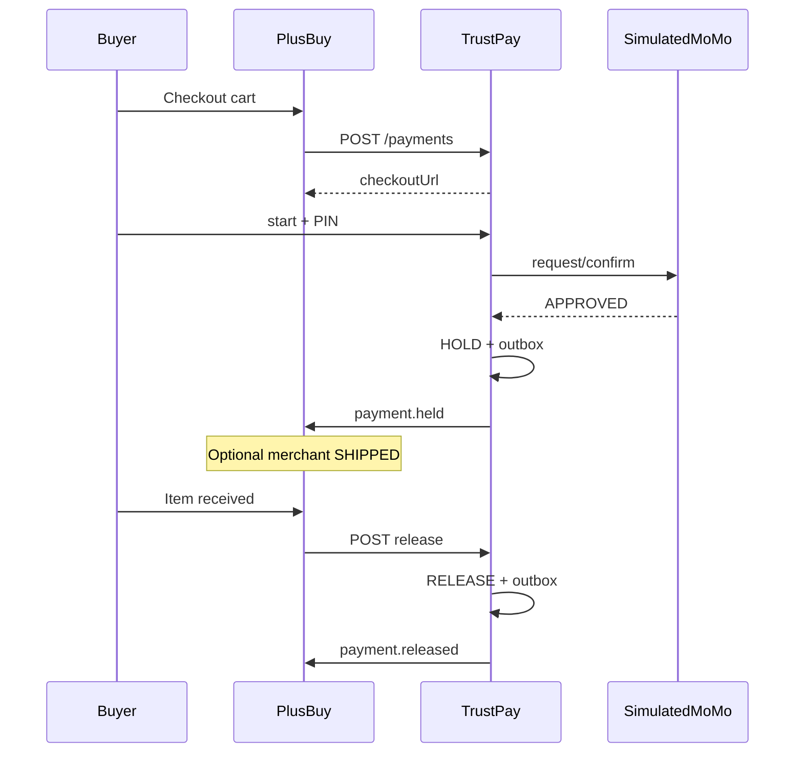

# Transaction Sequence Architecture

## Happy path (actual)

```mermaid
sequenceDiagram
  participant Buyer
  participant PlusBuy
  participant TrustPay
  participant MoMo as SimulatedMoMo
  Buyer->>PlusBuy: Checkout cart
  PlusBuy->>TrustPay: POST /payments
  TrustPay-->>PlusBuy: checkoutUrl
  Buyer->>TrustPay: start + PIN
  TrustPay->>MoMo: request/confirm
  MoMo-->>TrustPay: APPROVED
  TrustPay->>TrustPay: HOLD + outbox
  TrustPay->>PlusBuy: payment.held
  Note over PlusBuy: Optional merchant SHIPPED
  Buyer->>PlusBuy: Item received
  PlusBuy->>TrustPay: POST release
  TrustPay->>TrustPay: RELEASE + outbox
  TrustPay->>PlusBuy: payment.released
```

## Escrow release sequence
See `escrow_holding_and_release.mmd`.
