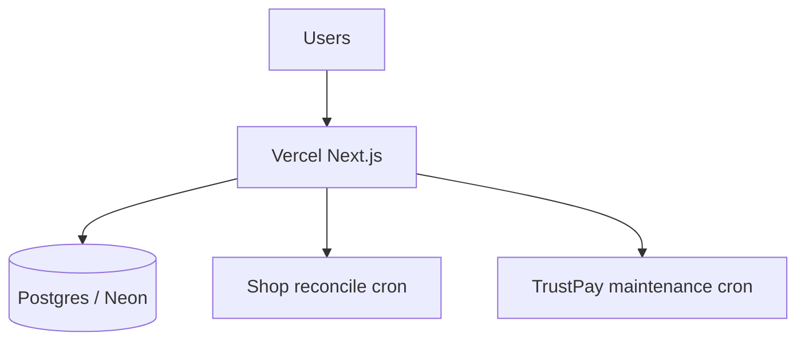

# Deployment Architecture

```mermaid
flowchart TB
  Users --> Vercel[Vercel Next.js]
  Vercel --> Neon[(Postgres / Neon)]
  Vercel --> CronShop[Shop reconcile cron]
  Vercel --> CronTP[TrustPay maintenance cron]
```

Local: `pnpm dev` + Docker/local Postgres. E2E uses Playwright against localhost:3000.
